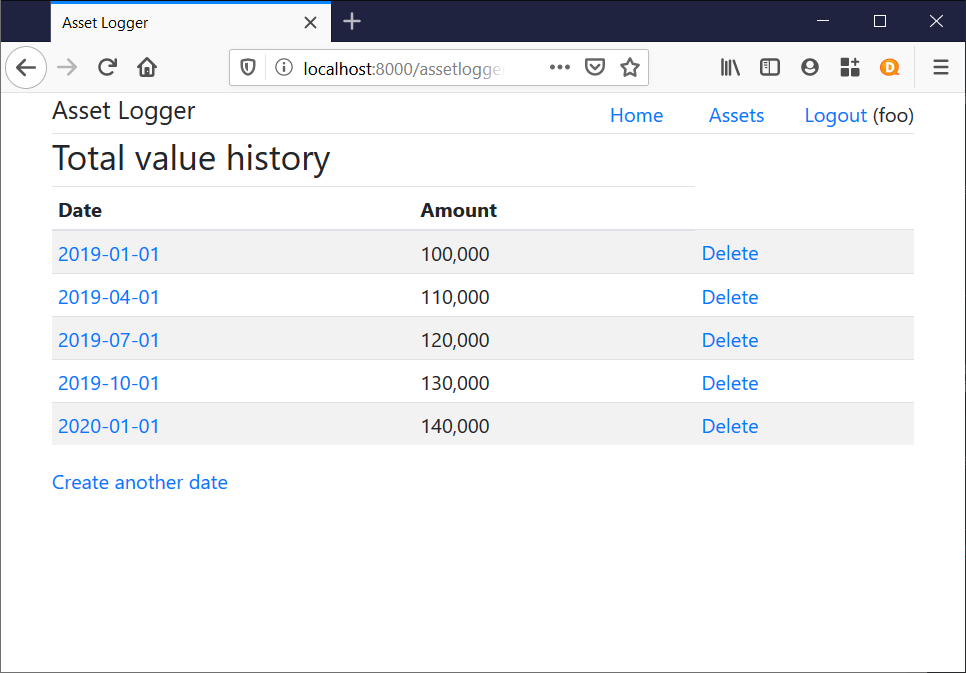

# Asset Logger

Log and track your financial assets. Web application based on Django.

## Development

### Setting up environment

Prerequisites: git, bash, python3, python3-venv.

Download repo.

    git clone https://github.com/bebaek/assetlogger.git

Run setup script.

    bash ci/setup-devenv.sh

### Running the app

Activate the dev environment:

    source ~/_venv/assetlogger/bin/activate

Run the following commands if your changes affect the structure of the stored
data.

    python manage.py makemigrations --dry-run
    python manage.py makemigrations
    python manage.py migrate

Start the app locally:

    python manage.py runserver

Go to the local site <http://localhost:8000> in a web browser.
Login as a user, which can be created from the admin site explained below.

### Using the admin site

If an admin user has not been created, run:

    python manage.py createsuperuser
    
Then run `python manage.py runserver` and access the admin site at
<http://localhost:8000/admin/>.
